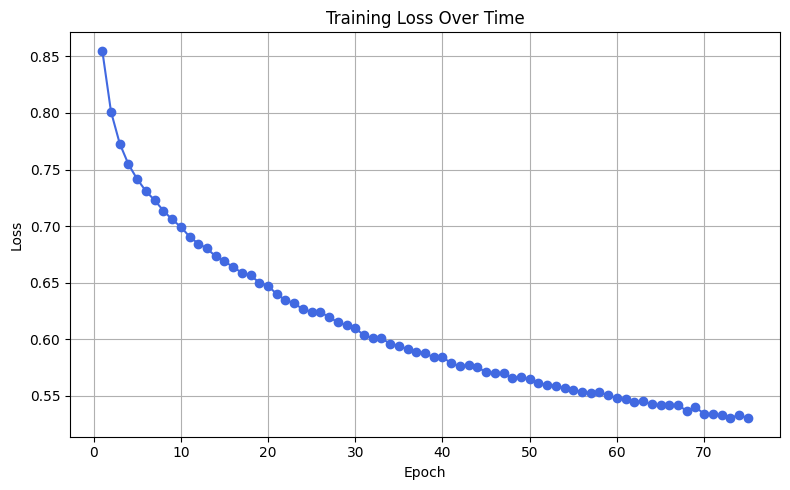
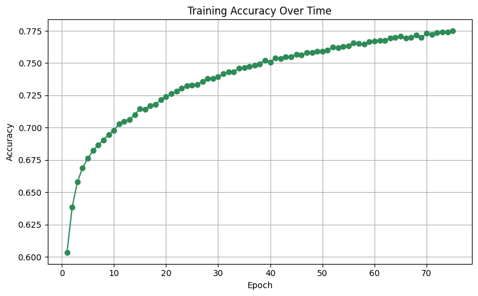
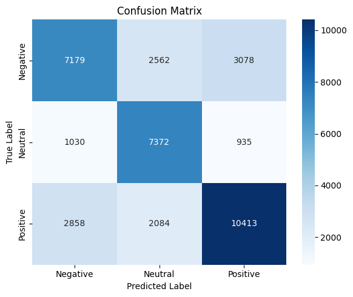
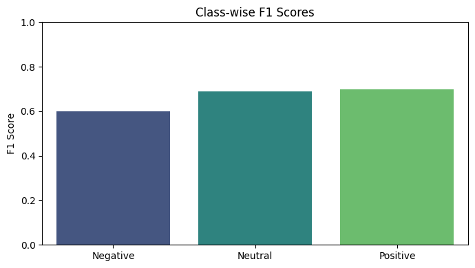

# **Real-Time Sentiment Analysis Dashboard (with Custom Neural Network Classifier)**

[](https://real-time-sentiment-dashboard.streamlit.app/)

🟢 **Live App:** [real-time-sentiment-dashboard.streamlit.app](https://real-time-sentiment-dashboard.streamlit.app/)

## **Project Overview**
This project is an end-to-end **real-time sentiment analysis pipeline** that ingests Reddit data, stores structured insights in PostgreSQL, applies deep learning classification, and visualizes everything on a responsive **Streamlit dashboard**.

What started with rule-based VADER analysis evolved into a **custom-trained MLP classifier**, built using PyTorch and powered by an autoencoder for feature compression.

---

## 🎯 **Objectives**
- Ingest real-time or simulated Reddit comments/posts using PRAW
- Preprocess and store incoming text data in PostgreSQL and AWS S3
- Apply sentiment classification via:
    - VADER (baseline)
    - MLP Neural Network (trained on labeled Reddit data)
    - BERT Neural Network Classifier
- Build a Streamlit dashboard to visualize sentiment trends
- Deploy all components using Docker
- Deploy pipeline to AWS (EC2, S3)

---

## 📊 **Data Collection & Motivation**
Reddit comments were collected in real-time during a culturally and socially active week to ensure sentiment diversity and class balance. I selected three subreddits based on topical relevance and emotional tone:

- **r/gaming**  
  Selected during the **Summer Games Fest**, a time when Reddit users actively discuss trailers, announcements, and reactions. This provided a rich source of **passionate, hype-driven, and sometimes critical** sentiment around game content.

- **r/news**  
  Captured during a week of high-profile events, including **protests in Los Angeles against ICE** and a viral **social media dispute between Donald Trump and Elon Musk**. This subreddit helped supply **polarizing or intense** sentiment data relevant to current events.

- **r/Showerthoughts**  
  Chosen to inject **balance** into the dataset by including a subreddit known for **lighthearted, introspective, or neutral-toned** content. This helped prevent skew toward overly negative sentiment from the other subreddits.

Together, these sources offered a **broad emotional range**—ideal for training a **multiclass sentiment classifier**.

---

## 🛠️ **Tools and Technologies**

| Category           | Tools                             |
| ------------------ | --------------------------------- |
| **Data Ingestion** | PRAW, Python                      |
| **Processing**     | Pandas, Scikit-learn, TF-IDF      |
| **Modeling**       | BERT, PyTorch (MLP, Autoencoder), VADER |
| **Visualization**  | Streamlit                         |
| **Storage**        | PostgreSQL, AWS S3                |
| **Deployment**     | Docker, AWS EC2 / S3              |

---

## 🤖 **Deep Learning Classifier**
A PyTorch-based **multiclass sentiment classifier** was trained on labeled Reddit comments using:
- **TF-IDF** vectorization with `max_features=1000`
- **Autoencoder** for dimensionality reduction
- **MLP classifier** with 3 hidden layers + dropout
- **Weighted cross-entropy loss** for class imbalance
- Tracked training loss, accuracy, and class-wise F1-scores over 75 epochs

MLP Classifier Model Performance:
| Class        | F1-Score |
| ------------ | -------- |
| Negative     | 0.62     |
| Neutral      | 0.70     |
| Positive     | 0.70     |
| **Accuracy** | **67%**  |

---

## 🧠 **Transformer-Based Modeling**
### Fine-Tuned BERT Classifier (VADER-Labeled Reddit Data)
To push sentiment classification performance to the next level, I fine-tuned a BERT-based deep learning model using Hugging Face Transformers. This model achieved **95% accuracy** on validation data, significantly outperforming traditional models and serving as the final predictor for real-time inputs.

**Key Highlights:**
- Model: `bert-base-uncased` fine-tuned for multiclass sentiment
- Labels: Negative (0), Neutral (1), Positive (2)
- Tokenization: BERT's WordPiece tokenizer (max length: 512)
- Trained using Hugging Face `Trainer` API with `fp16` mixed precision for speed
- Exported and deployed in Streamlit with real-time inference support

**Real-Time Predictor Feature:**
- Accessible in the first tab of the Streamlit dashboard
- Accepts user-entered text and returns instant sentiment prediction
- Powered by the trained BERT model hosted in the app

**Final Model Performance:**
| Metric        | Score     |
|---------------|-----------|
| Accuracy      | 95.3%     |
| F1 (Macro)    | 0.95      |
| F1 (Weighted) | 0.95      |

This model is now integrated as the **primary inference engine** for the real-time Reddit sentiment dashboard.

### **RoBERTa Sentiment Labeler (`cardiffnlp/twitter-roberta-base-sentiment`)**
To explore **weak supervision**, I replaced VADER with a pretrained 3-class BERT model. This enabled me to:
- Automatically label both comments and posts with `"negative"`, `"neutral"`, or `"positive"` sentiment
- Use those labels to retrain Logistic Regression, Random Forest, and MLP models

**Model Performance between VADER and RoBERTa Labeled Data:**
| Model         | Macro F1 (VADER) | Macro F1 (RoBERTa) |
| ------------- | ---------------- | ------------------ |
| Logistic Reg. | 0.74             | 0.65               |
| Random Forest | 0.74             | 0.62               |
| Custom MLP    | 0.70             | 0.63               |

Although performance dropped slightly when using RoBERTa-labeled data, the results confirmed that RoBERTa can still be used effectively as a weak-supervision tool. The experience also validated the superior performance of my fine-tuned BERT classifier, which achieved the highest scores overall.

---

## 🗺️ **Architecture Overview**
```text
[Reddit API]
    ↓
[PRAW Ingestion Script (Docker)]
    ↓
[Structured Data Store (PostgreSQL) in EC2 cloud instance]
    ↓
[AWS S3]
    ↓
[Sentiment Analysis Classifier (VADER + BERT)]
    ↓
[Streamlit Dashboard]
```

---

## 🚀 **Core Features**
- Live Reddit ingestion
- Real-time sentiment labeling (comments and posts)
- Custom neural network with TF-IDF + autoencoder
- Saved and reusable model weights + training curves
- Advanced Transformer-based Modeling
- Interactive visualizations and dashboards

---

## 🌱 **Stretch Goals**
- Deploy model via AWS Lambda + API Gateway
- Real-time stream processing with Kafka or Kinesis
- Add live model inference into ingestion pipeline
- Transform and document data using dbt

---

## 📈 **Data Visualizations**

### MLP Loss Over Time


### Accuracy Over Time Plot


### Confusion Matrix Heatmap


### Class-wise F1 Scores


---

## 📌 **Insights & Takeaways**
- **Traditional models such as Logistic Regression performed well with VADER labels.**
- **Replacing VADER with RoBERTa sentiment labeling revealed the challenges of weak supervision.**
- **Fine-tuning BERT directly on VADER-labeled Reddit data delivered state-of-the-art results, reaching 95% accuracy.**
- **Gained hands-on experience building and deploying a fully interactive Streamlit dashboard, complete with data visualizations and a real-time sentiment prediction tool powered by my fine-tuned BERT model.**
- **This project demonstrates not just pipeline engineering, but also *how data quality and model architecture impact real-world performance*.**
